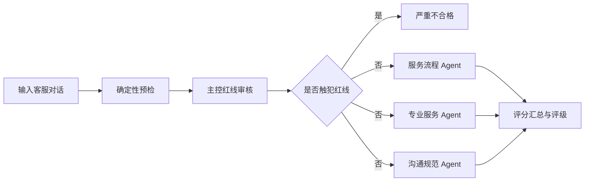
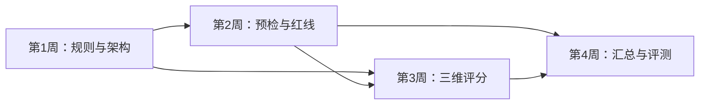

# 多 Agent 客服质检项目整体工作内容

## 1. 项目概述

本项目面向客服对话质量审核场景，使用 LangGraph 编排多 Agent 工作流，将人工质检规则转化为可执行、可分支、可追踪的自动化流程。

系统接收客服会话和业务标签，先完成确定性预检和严重红线审核；未触犯红线时，并行执行服务流程、专业服务、沟通规范三个维度的评分；最后汇总为总分、评级、扣分原因、证据和执行轨迹。

整体流程如下：

## 2. 四周工作安排

### 第1周：业务规则梳理与 LangGraph 工作流设计

#### 本周目标

理解客服质检业务，明确三维评分体系和红线拦截标准，完成后续开发所需的规则、工作流和状态结构设计。

#### 工作内容

1. **质检维度拆解**
   - 梳理服务流程、专业服务、沟通规范三个维度。
   - 明确每个维度的子项、原始分值、扣分条件和免责条件。
   - 对齐最终业务权重：服务流程20%、专业服务40%、沟通规范40%。
   - 梳理“同一问题不重复扣分”等跨维度规则。

2. **红线与预检规则定义**
   - 明确严重推诿、威胁辱骂、信息泄露、未授权操作和违规承诺等红线。
   - 区分确定性检查与语义判断。
   - 定义输入完整性、角色、轮次、问候、结束语、回复时间、标签和关键词扫描规则。
   - 明确无角色、无时间戳等数据缺失时的处理方式。

3. **LangGraph 架构设计**
   - 设计输入规范化、预检、主控、三个维度评分和汇总节点。
   - 设计红线短路、正常放行和技术异常转人工的条件路由。
   - 设计三个维度节点的并行执行和汇总方式。

4. **状态数据结构定义**
   - 定义原始输入、标准消息、预检报告和红线结果。
   - 定义三个维度评分、技术错误、执行轨迹和最终结果。
   - 统一输入、节点输出和最终结果的数据契约。

#### 本周交付物

- 《客服质检规则映射表》
- 《预检规则清单与触发条件》
- LangGraph 工作流拓扑图
- 《状态数据结构规范》
- 第一版技术方案

#### 完成标准

- 三个维度的评分和最终权重不存在冲突。
- 红线触发条件、免责条件和短路行为明确。
- 确定性预检和模型语义判断的边界明确。
- 工作流覆盖正常、红线和技术异常三类路径。
- 状态字段能够承载所有节点的输入和输出。

### 第2周：确定性预检与主控红线拦截开发

#### 本周目标

完成输入处理、确定性预检和主控红线审核，使系统能够根据红线结果正确选择后续执行路径。

#### 工作内容

1. **项目骨架和配置建设**
   - 建立 Python 项目目录、依赖管理和环境变量模板。
   - 建立规则、Prompt、模型和评分权重配置。
   - 实现第一周定义的数据模型。

2. **输入适配与预检节点开发**
   - 将正式消息结构转换为统一格式。
   - 为当前 `comments` 纯文本样例提供开发期适配器。
   - 实现角色、轮次、问候、结束语、时效、标签和风险词扫描。
   - 输出结构化 `preflight_report`。

3. **主控红线 Agent 开发**
   - 重构红线 Prompt，注入预检事实和规则版本。
   - 使用结构化输出返回各红线项、证据、原因和总体结果。
   - 防止单个关键词直接造成语义误判。

4. **条件路由实现**
   - 红线命中时跳过三个评分节点，直接进入汇总。
   - 主控失败或证据不足时转入人工复核结果。
   - 正常通过时进入三个评分节点。

5. **轨迹日志建设**
   - 记录节点名称、输入摘要、输出状态、耗时、重试和错误。
   - 记录模型、Prompt 和规则版本。
   - 对日志中的隐私信息进行脱敏。

#### 本周交付物

- 可配置的预检功能模块
- 主控红线 Agent 和 Prompt
- 条件路由实现
- 红线与路由测试用例
- 节点执行轨迹规范及示例日志

#### 完成标准

- 正常数据、红线数据和异常数据均能进入正确分支。
- 红线命中后不会调用三个评分 Agent。
- 缺失时间戳时不会错误扣除时效分。
- 主控输出通过数据结构校验。
- 节点异常能够被记录并返回明确状态。

### 第3周：三维度并行质检 Agent 开发

#### 本周目标

实现服务流程、专业服务、沟通规范三个评分 Agent，并在 LangGraph 中并行运行。

#### 工作内容

1. **服务流程 Agent**
   - 审核热情迎接、了解需求、完整回复、正确标签和礼貌送客。
   - 使用预检结果辅助判断问候、结束语和标签。
   - 应用用户不配合、问题提前解决等免责规则。

2. **专业服务 Agent**
   - 根据 `parentTag` 加载对应业务规则。
   - 审核问题分析与解答、服务意识和沟通反馈。
   - 输出所用专业规则编号、扣分原因和证据。

3. **沟通规范 Agent**
   - 审核规范用语、语言文字、接入时效、回复时效和转接规范。
   - 仅在角色和时间数据完整时评价时效项。

4. **并行执行配置**
   - 主控通过后并发启动三个维度节点。
   - 三个节点写入各自独立的 State 字段。
   - 对模型超时、限流和临时错误设置有限重试。

5. **输出校验与业务解释**
   - 使用 Pydantic 校验分数范围、枚举值和证据编号。
   - 每项扣分必须包含规则、原因和原消息证据。
   - 结构化输出失败时重试；仍失败则标记技术异常。

#### 本周交付物

- 三维度 Agent 实现及设计说明
- 三维度并行工作流
- 评分解析和容错模块
- 带规则和对话证据的可解释结果示例
- 三个维度的单元测试和集成测试

#### 完成标准

- 三个 Agent 能独立运行并生成合法的结构化结果。
- 三个节点能够并行执行且不存在 State 写入冲突。
- 专业服务 Agent 能按父标签选择正确的规则。
- 扣分项可定位到规则编号和对话消息。
- 技术异常不会被当成客服业务0分。

### 第4周：状态聚合、评分计算、MCP 服务化与效果测试

#### 本周目标

完成多维结果融合、业务评级、异常兜底、MCP 规则服务和端到端效果评测，形成可演示的基础版本。

#### 工作内容

1. **汇总节点开发**
   - 校验主控和三个维度结果是否完整。
   - 按业务权重换算为0—100分。
   - 按问题编号处理跨维度重复扣分。
   - 汇总规则、证据和改进建议。

2. **业务评级与反馈生成**
   - 总分大于等于90：优秀。
   - 总分大于等于60且小于90：合格。
   - 总分小于60：严重问题。
   - 红线命中：严重不合格并跳过三维评分。
   - 技术失败或证据不足：待人工复核。

3. **异常边界处理**
   - 处理输入缺失、标签未知和预检失败。
   - 处理主控解析失败、模型超时和子结果缺失。
   - 明确重试、降级、告警和人工复核策略。

4. **MCP 规则服务建设**
   - 将“根据业务类型获取对应专业规则”封装为 MCP 工具。
   - 定义工具输入、输出、未知标签错误和服务日志。
   - 根据演示环境选择本地调用或 HTTP 服务方式。

5. **端到端效果测试**
   - 使用现有样例执行批量质检。
   - 建设人工金标集和典型红线反例。
   - 统计红线召回率、精确率、评分误差、评级一致率、格式成功率和执行时延。
   - 整理失败案例并调优规则和 Prompt。

#### 本周交付物

- 总分计算模块
- 评级与反馈生成器
- 异常边界处理方案
- 专业规则 MCP 服务
- 端到端演示程序
- 测试集效果报告和失败案例分析

#### 完成标准

- 正常、红线和异常路径均能生成稳定的最终输出。
- 权重计算、评级边界和去重逻辑通过测试。
- MCP 工具能根据业务类型返回正确规则。
- 测试报告中的指标来自实际数据，不使用未经验证的预设成果。
- 项目可以完成一次可复现的端到端演示。

## 3. 周次之间的依赖关系

第一周确定规则和数据契约；第二周先实现入口和门控；第三周在稳定输入和门控基础上增加三个评分分支；第四周完成结果融合、服务化和效果验证。每周都应保留可运行、可测试的阶段性版本。

## 4. 项目最终交付内容

1. 客服质检业务规则和版本化配置。
2. 基于 LangGraph 的多 Agent 质检工作流。
3. 确定性预检、红线门控和三个评分 Agent。
4. 结构化状态、评分汇总、评级和异常处理模块。
5. 专业业务规则 MCP 服务。
6. 单元测试、路由测试和端到端测试。
7. 人工金标集、效果指标和失败案例报告。
8. 项目说明、技术方案和运行演示文档。

