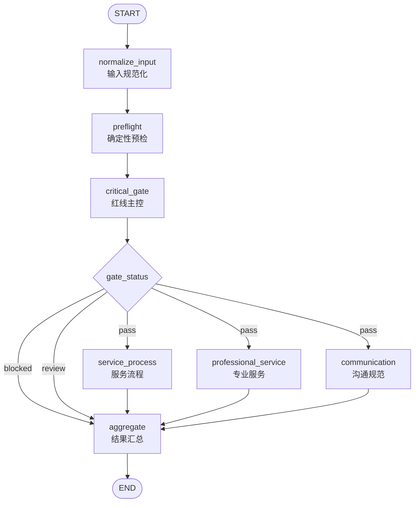

# 多 Agent 客服质检第一周技术方案与后续实施规划

## 1. 方案目标

第一周不以完成全部代码为目标，而是把业务规则和技术边界定义清楚，使第二周可以直接进入开发。

本周重点完成四项工作：

1. 建立客服质检规则映射。
2. 明确确定性预检和红线判断边界。
3. 设计 LangGraph 工作流拓扑。
4. 定义贯穿全流程的 State 数据结构。

技术方案同时说明这些设计在第二至第四周如何落实，避免每周单独设计后产生接口冲突。

## 2. 当前输入材料和问题

项目材料目前包括：

- 100条客服对话样例。
- 22个父业务分类的专业扣分规则。
- 红线、服务流程、专业服务、沟通规范四套 Prompt。
- 四周工作任务和预期流程。

当前数据字段为：

```text
ticketId、messages、comments、tag、parentTag
```

其中100条样例的 `messages` 均为空，实际对话保存在 `comments` 中。`comments` 只有换行后的文本，没有明确角色和时间戳。这会带来三个问题：

1. 不能可靠识别每句话的说话人。
2. 不能计算90秒接入时效和5分钟回复时效。
3. 不能把现有样例直接当成正式生产输入格式。

本方案采用以下处理方式：

- 为当前已知样例单独建立开发适配器，约定首行是用户，之后用户与客服交替，并记录 `role_source=inferred`。
- 正式输入要求每条消息携带角色；时间类规则需要时间戳。
- 时间戳缺失时将时效项标记为“无法评估”，不直接扣分。
- 后续效果测试需要增加人工标准答案，现有样例本身不是评分金标集。

## 3. 第一周交付物一：客服质检规则映射

### 3.1 红线规则

红线优先于三维评分。一旦确认触犯红线，流程直接进入汇总并输出“严重不合格”。

| 编号 | 红线类型 | 典型行为 | 判定要求 |
|---|---|---|---|
| CR-01 | 严重服务态度问题 | 明确拒绝处理、严重推诿、极端冷漠、反复敷衍 | 结合对话上下文判断是否真正拒绝履职 |
| CR-02 | 冲突与不当沟通 | 威胁、争吵、辱骂、贬低、恶意质问用户 | 必须确认说话人和行为对象 |
| CR-03 | 信息安全违规 | 泄露客户隐私、公司机密、内部运营信息、恶意导流 | 区分正常核验、脱敏信息和真实泄露 |
| CR-04 | 未授权行为 | 擅自拉黑账号、越权操作、违反规则承诺赔付或结果 | 结合业务权限和标准流程判断 |

关键词命中只能作为风险线索，不能直接产生红线结论。例如，对话中出现“骗子”可能是用户描述钓鱼短信，并不代表客服辱骂用户。

红线审核还需应用以下免责条件：

- 用户不配合或长时间无响应时，客服友善关闭会话。
- 问题已经解决后，客服正常结束对话。
- 用户要求电话或主管沟通，客服按规则友善说明无法转接。
- 客服对用户进行合理说明、引导或纠正。

### 3.2 三维评分映射

| 维度 | 评分子项 | 原始满分 | 最终权重 |
|---|---|---:|---:|
| 服务流程 | 热情迎接、了解需求、完整回复、正确标签、礼貌送客 | 25 | 20% |
| 专业服务 | 分析问题并解答、服务意识、沟通反馈 | 50 | 40% |
| 沟通规范 | 规范用语、语言文字规范、接入时效、回复时效、转接规范 | 25 | 40% |

最终分数统一换算为：

```text
总分 = 服务流程原始分 / 25 × 20
     + 专业服务原始分 / 50 × 40
     + 沟通规范原始分 / 25 × 40
```

评级规则：

| 条件 | 结果 |
|---|---|
| 触犯任一红线 | 严重不合格，跳过三个维度评分 |
| 未触犯红线且总分 ≥ 90 | 优秀 |
| 未触犯红线且 60 ≤ 总分 < 90 | 合格 |
| 未触犯红线且总分 < 60 | 严重问题 |
| 输入或关键节点失败 | 待人工复核，不生成误导性业务分数 |

### 3.3 专业规则映射

专业服务 Agent 根据 `parentTag` 选择对应规则，不需要把22类规则全部注入一次模型调用。

| 业务组 | `parentTag` | 主要审核内容 |
|---|---|---|
| 账户与支付 | 账户安全、支付问题 | 账户保护、诈骗识别、换绑与申诉、支付排查 |
| 订单与退款 | 订单管理、订单问题、退款管理 | 查询、取消、费用拆解、售后、退款状态与时效 |
| 配送与安全 | 配送服务、食品安全 | 骑手状态、配送异常、餐品撒漏、异物与安全升级 |
| 营销与权益 | 优惠活动、会员服务、积分体系、平台活动、邀请推荐计划 | 使用门槛、有效期、权益范围和替代方案 |
| 商家与到店 | 商家服务、到店服务、团购活动、评价管理 | 入驻、履约、拼团、到店服务和评价申诉 |
| 平台类服务 | 开放平台、APP使用问题、平台服务、企业服务、发票服务、客户服务质量 | API权限、客户端排查、平台范围、企业流程、开票和投诉 |

第一版采用精确标签选择规则，暂不引入向量数据库。规则量较小并且输入已有父标签时，精确选择更容易验证。后续只有在标签经常缺失或规则数量明显扩大时，再增加检索模块。

### 3.4 跨维度规则

1. 同一个服务问题只扣一次分，扣分项生成统一 `issue_id`，在汇总阶段去重。
2. 用户不配合、无响应或问题提前解决时，应用对应免责条款。
3. 客服先给出错误信息但随后主动纠正，应按照纠错规则判断。
4. 时效评分必须有角色和时间戳支持。
5. 标签评分需要标准标签目录；未知标签应转人工确认。
6. 技术错误与业务扣分分开记录，模型超时或输出解析失败不等于客服得0分。

## 4. 第一周交付物二：预检规则清单

预检负责可由 Python 稳定计算的事实，不负责需要理解语义、对象、权限和免责条件的最终判断。

| 编号 | 检查内容 | 触发条件 | 输出 | 后续用途 |
|---|---|---|---|---|
| PF-01 | 输入完整性 | 工单号、标签或对话缺失 | 输入错误列表 | 决定是否转人工或拒绝运行 |
| PF-02 | 角色合法性 | 角色不属于用户、客服、系统 | 角色错误列表 | 防止错误归责 |
| PF-03 | 旧样例适配 | 只有 `comments` 且符合已知样例格式 | 推断消息和推断标识 | 支持开发样例运行 |
| PF-04 | 时间合法性 | 时间缺失、格式错误或逆序 | 是否可计算时效及原因 | 控制时效项是否参评 |
| PF-05 | 对话统计 | 对全部有效消息统计 | 用户、客服、系统消息数和轮次 | 为各 Agent 提供事实 |
| PF-06 | 问候检查 | 首条人工客服消息未命中欢迎语 | 布尔值和消息编号 | 服务流程评分依据 |
| PF-07 | 结束语检查 | 最后一条客服消息未命中结束语 | 布尔值和消息编号 | 服务流程评分依据 |
| PF-08 | 接入时效 | 连接客服到首次人工回复超过90秒 | 时长和相关消息 | 沟通规范评分依据 |
| PF-09 | 回复时效 | 用户消息到下一客服回复超过5分钟 | 超时消息列表 | 沟通规范评分依据 |
| PF-10 | 红线词扫描 | 客服消息命中辱骂、威胁、推诿等词库 | 词语、消息编号、上下文 | 主控红线审核线索 |
| PF-11 | 敏感信息扫描 | 命中手机号、身份证、密钥等模式 | 类型和脱敏证据 | 主控信息安全线索 |
| PF-12 | 标签检查 | 父标签不在规则目录或子标签为空 | 标签告警 | 规则选择或人工复核 |
| PF-13 | 重复回复 | 客服连续重复相同短句 | 相关消息编号 | 服务态度判断线索 |
| PF-14 | 转接检查 | 对话包含人工或部门转接 | 转接次数、话术和消息编号 | 转接规范评分依据 |

预检结果只记录事实。例如 `redline_keyword_hits` 不等于 `redline_triggered`，后者只能由主控结合完整对话得出。

## 5. 第一周交付物三：LangGraph 工作流设计

### 5.1 工作流拓扑



### 5.2 节点职责

| 节点 | 实现类型 | 主要输入 | 主要输出 |
|---|---|---|---|
| `normalize_input` | Python | 原始请求 | 标准消息、输入告警、角色来源 |
| `preflight` | Python | 标准消息、标签 | 预检报告 |
| `critical_gate` | LLM | 消息、预检、红线规则 | 分项红线结论、证据、门控状态 |
| `service_process` | LLM | 消息、预检、流程规则 | 服务流程评分 |
| `professional_service` | LLM+规则工具 | 消息、业务标签、专业规则 | 专业服务评分 |
| `communication` | LLM | 消息、预检、沟通规则 | 沟通规范评分 |
| `aggregate` | Python | 门控结果、评分结果和错误 | 最终质检结果 |

### 5.3 路由规则

`critical_gate` 输出统一的 `gate_status`：

- `blocked`：确认触犯红线，直接汇总为严重不合格。
- `review`：输入不足、主控失败或证据不足，汇总为待人工复核。
- `pass`：未触犯红线，并行执行三个评分节点。

三个评分节点分别写入独立字段，避免并行写入冲突。如果后续需要由多个节点同时追加同一个列表，应为该字段定义 reducer，或者先写独立字段再由汇总节点合并。

## 6. 第一周交付物四：State 数据结构

### 6.1 建议结构

```python
from typing import Literal, TypedDict


class Message(TypedDict):
    message_id: str
    role: Literal["end-user", "agent", "system"]
    content: str
    timestamp: str | None


class AuditState(TypedDict, total=False):
    # 请求与版本
    audit_id: str
    ticket_id: str
    tag: str
    parent_tag: str
    raw_input: dict
    messages: list[Message]
    role_source: Literal["provided", "inferred"]
    rule_version: str
    prompt_version: str
    model_name: str

    # 节点中间结果
    input_warnings: list[dict]
    preflight_report: dict
    redline_result: dict
    gate_status: Literal["pass", "blocked", "review"]
    service_process_result: dict
    professional_service_result: dict
    communication_result: dict

    # 运行状态和最终结果
    node_traces: dict[str, dict]
    technical_errors: list[dict]
    final_audit: dict
```

### 6.2 状态使用约束

1. 节点只返回自己需要更新的字段，不复制和重写完整 State。
2. 三个并行节点写入不同结果字段。
3. `raw_input` 仅用于审计，记录日志前必须脱敏。
4. Agent 优先读取规范化后的 `messages`，避免各自解析原始文本。
5. 三维结果采用统一结构：原始分、满分、结论、扣分项、证据和异常。
6. `final_audit` 是对外输出的唯一来源。

### 6.3 Agent 输出结构

每个评分 Agent 的扣分项至少包含：

```json
{
  "rule_id": "PS-ACCOUNT-01",
  "issue_id": "issue-001",
  "result": "deducted",
  "deduction": 10,
  "reason": "客服未引导用户立即修改密码",
  "evidence_message_ids": ["m2", "m4"]
}
```

使用消息编号引用证据，避免模型只输出无法核对的概括。

## 7. 输入输出契约

### 7.1 正式输入示例

```json
{
  "ticket_id": "10001",
  "tag": "账户-登录异常",
  "parent_tag": "账户安全",
  "messages": [
    {
      "message_id": "m1",
      "role": "end-user",
      "content": "你好，我的账户无法登录。",
      "timestamp": "2026-09-18T10:00:00+08:00"
    },
    {
      "message_id": "m2",
      "role": "agent",
      "content": "您好，请问页面有什么提示？",
      "timestamp": "2026-09-18T10:00:30+08:00"
    }
  ]
}
```

### 7.2 最终输出示例

```json
{
  "audit_id": "uuid",
  "ticket_id": "10001",
  "status": "completed",
  "redline": {
    "triggered": false,
    "items": []
  },
  "dimensions": {
    "service_process": {
      "raw_score": 25,
      "max_score": 25,
      "weighted_score": 20,
      "findings": []
    },
    "professional_service": {
      "raw_score": 45,
      "max_score": 50,
      "weighted_score": 36,
      "findings": []
    },
    "communication": {
      "raw_score": 20,
      "max_score": 25,
      "weighted_score": 32,
      "findings": []
    }
  },
  "total_score": 88,
  "grade": "合格",
  "manual_review_reasons": [],
  "trace": []
}
```

## 8. 后续三周的实施方式

### 8.1 第二周：把第一周的设计变成入口和红线门控

第二周先建立项目骨架和数据模型，再实现 `normalize_input`、`preflight` 和 `critical_gate`。

建议实施顺序：

1. 创建项目目录、依赖文件和环境变量示例。
2. 将本方案的输入、状态和输出转换为 Pydantic 模型。
3. 把红线、评分、权重和评级写入版本化配置。
4. 实现当前100条样例的适配器和正式消息适配器。
5. 为每一条预检规则编写独立函数和单元测试。
6. 重构红线 Prompt，并使用结构化输出。
7. 建立 `StateGraph` 的前半部分和条件路由。
8. 使用正常、红线、输入缺失三类样例测试路由。

第二周完成后，系统虽然还没有三个评分 Agent，但应能稳定展示：输入如何被解析、预检发现了什么、是否触犯红线、下一步走哪条路径。

### 8.2 第三周：增加三个并行评分分支

第三周根据第一周规则映射分别实现三个 Agent。

建议实施顺序：

1. 先实现规则较固定的服务流程 Agent。
2. 实现沟通规范 Agent，并处理无时间戳时的不可评估项。
3. 将22类专业规则整理为带编号的配置。
4. 实现按 `parentTag` 查询专业规则的工具。
5. 实现专业服务 Agent。
6. 把三个节点从主控的 `pass` 分支并行拉起。
7. 使用 Pydantic 校验三个 Agent 的输出。
8. 加入一次有限重试和技术错误记录。

第三周重点验证输出可解释性。每项扣分都应回答三个问题：违反哪条规则、对话中的证据是什么、扣了多少分。

### 8.3 第四周：汇总、MCP和效果验证

第四周实现 `aggregate`，并完成可演示版本。

建议实施顺序：

1. 校验三维结果并执行分数归一化。
2. 按 `issue_id` 处理跨维度重复扣分。
3. 生成总分、评级和改进建议。
4. 对节点超时、空响应和结果缺失建立人工复核兜底。
5. 将专业规则查询工具封装成 MCP 服务。
6. 从现有样例选择30至50条建立人工金标集，并增加红线反例。
7. 批量运行并计算红线召回率、精确率、分数误差、评级一致率和时延。
8. 分析失败案例，调整规则和 Prompt 后执行回归测试。

第四周最终应展示完整链路：输入一条对话，看到节点执行轨迹，获得红线结果或三维分数，并能追溯每项扣分依据。

## 9. 测试方案

| 测试层次 | 测试内容 | 通过标准 |
|---|---|---|
| 单元测试 | 输入适配、时间计算、问候结束语、关键词和分数公式 | 确定性函数输出符合规则 |
| Schema测试 | 分数范围、枚举、证据编号和必填字段 | 非法输出不能进入状态 |
| 路由测试 | 红线短路、正常并行、异常转人工 | 实际路径与拓扑一致 |
| Agent测试 | 三维满分、单项扣分、免责和证据引用 | 与人工预期一致 |
| 集成测试 | 完整图运行、并行分支和汇总 | 生成稳定的最终结构 |
| 效果评测 | 红线、分数、评级、格式和时延 | 输出真实指标和失败案例 |

不要直接使用项目说明中的“覆盖率98%、时长缩短90%、质量提升90%”作为成果。这些数字只有在第四周建立人工基线并实际测试后才能填写。

## 10. 第一周完成检查

- [x] 明确三个维度的原始分和最终权重。
- [x] 定义四类红线、判定原则和免责条件。
- [x] 区分确定性预检与模型语义审核。
- [x] 设计红线短路、正常并行和异常转人工路径。
- [x] 定义共享 State 和各节点写入字段。
- [x] 定义正式输入和最终输出示例。
- [x] 说明现有无角色、无时间戳样例的使用限制。
- [x] 给出第二至第四周的具体实施顺序。
- [ ] 与导师确认红线范围、正式数据字段和评测阈值。

## 11. 需要与导师确认的事项

1. “威胁”和“违规承诺”是否纳入现有四类红线，业务上的具体边界是什么。
2. 红线命中后是否只展示“严重不合格”，还是仍要求展示0分。
3. 正式数据是否包含消息角色、时间戳、系统转接事件和标准标签目录。
4. “同一问题不重复扣分”是否要求跨三个维度全局去重。
5. 人工金标由谁确认，各评测指标的验收阈值是多少。
6. MCP 服务最终只需本地演示，还是需要通过 HTTP 供外部系统调用。

## 12. 技术参考

- LangGraph 的 State、节点、普通边和条件边：[Graph API overview](https://docs.langchain.com/oss/python/langgraph/graph-api)
- LangGraph 并行分支、fan-out/fan-in 和 reducer：[Use the graph API](https://docs.langchain.com/oss/python/langgraph/use-graph-api)
- Pydantic、TypedDict 和 JSON Schema 结构化输出：[Structured output](https://docs.langchain.com/oss/python/langchain/structured-output)
- 使用 checkpointer 保存各步骤状态和恢复执行：[Persistence](https://docs.langchain.com/oss/python/langgraph/persistence)

