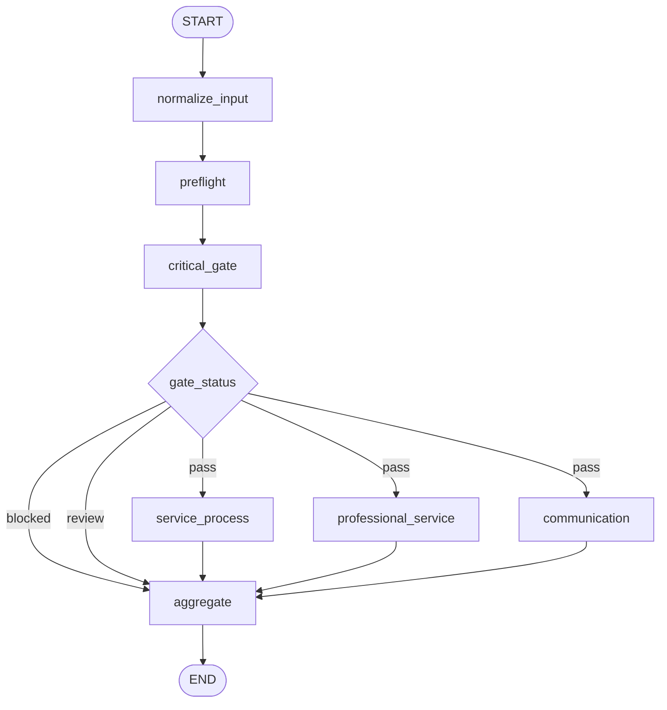

# LangGraph 工作流拓扑设计

## 1. 设计目标

- 红线审核先于普通评分，并支持一票拦截。
- 三个评分维度在主控通过后并行执行。
- 技术失败不会被解释为客服业务违规。
- 节点输入输出都通过共享 State 传递。
- 每个结果都能追踪到规则、证据和执行节点。

## 2. 拓扑图

## 3. 节点定义

| 节点 | 类型 | 读取 | 写入 | 计划周次 |
|---|---|---|---|---|
| `normalize_input` | Python | 原始请求 | 标准消息、输入告警 | 第2周 |
| `preflight` | Python | 标准消息、标签 | 预检报告 | 第2周 |
| `critical_gate` | LLM | 消息、预检、红线规则 | 红线结论、门控状态 | 第2周 |
| `service_process` | LLM | 消息、预检、流程规则 | 服务流程结果 | 第3周 |
| `professional_service` | LLM+规则工具 | 消息、标签、专业规则 | 专业服务结果 | 第3周 |
| `communication` | LLM | 消息、预检、沟通规则 | 沟通规范结果 | 第3周 |
| `aggregate` | Python | 门控、评分和错误 | 最终结果 | 第4周 |

## 4. 路由契约

主控统一输出 `gate_status`：

| 状态 | 含义 | 后继节点 |
|---|---|---|
| `blocked` | 已确认触犯至少一项红线 | `aggregate` |
| `review` | 输入不足、证据不足或主控技术失败 | `aggregate` |
| `pass` | 未触犯红线，可以继续评分 | 三个评分节点 |

路由函数只读取经过 Schema 校验的 `gate_status`，不再次解析模型自然语言。

## 5. 并行状态策略

三个评分节点分别写入：

- `service_process_result`
- `professional_service_result`
- `communication_result`

因此它们不会竞争同一个 State 字段。第一版让各节点把轨迹写入各自结果，由汇总节点统一生成 `node_traces`；如果改为并行追加同一个列表，需要为该字段配置列表 reducer。

## 6. 异常路径

| 异常 | 处理 |
|---|---|
| 输入无有效对话 | 不调用模型，`gate_status=review` |
| 主控超时或结构校验失败 | 有限重试一次，仍失败则 `review` |
| 单个评分节点失败 | 记录 `technical_error`，最终结果转人工复核 |
| 未知父标签 | 专业评分不可执行，最终结果转人工复核 |
| 汇总字段越界 | 拒绝生成业务分数，记录 Schema 错误 |

## 7. 可追踪信息

每个节点至少记录：

- 节点名称；
- 开始、结束时间和耗时；
- 规则、Prompt和模型版本；
- 输入摘要和输出状态；
- 重试次数；
- 错误类型和脱敏错误信息。

