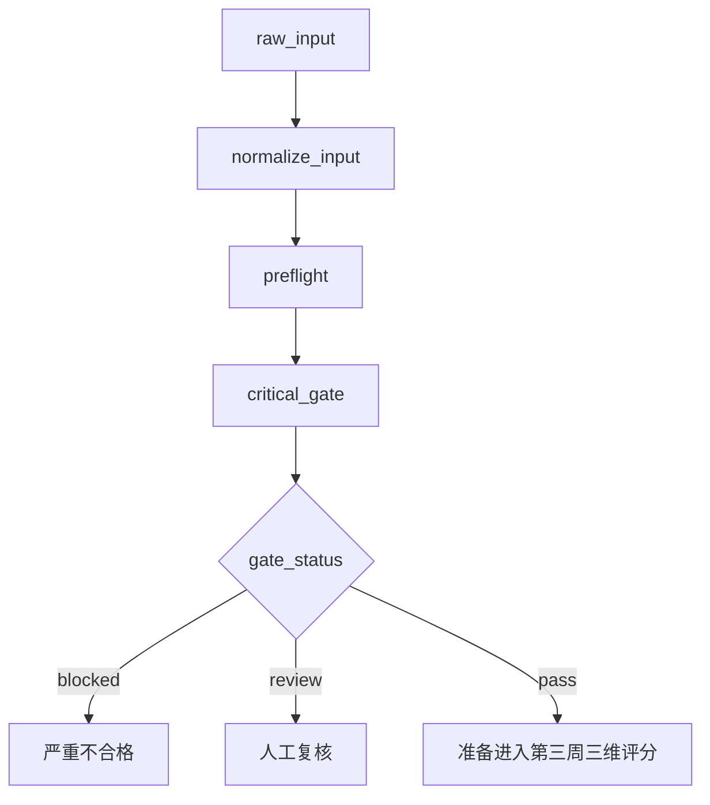

# Week 2 implementation

第二周完成了输入规范化、14项确定性预检、结构化红线主控、条件路由、节点轨迹与技术异常兜底。

## Data flow



## Implemented modules

- `schemas/`：消息、标准会话、预检、红线结果和 LangGraph State。
- `adapters/`：正式消息输入和当前 `comments` 历史样例适配。
- `preflight/`：输入、角色、时间、轮次、问候、结束语、时效、关键词、敏感信息、标签、重复回复和转接检查。
- `agents/critical.py`：OpenAI兼容模型结构化输出、证据校验、一次重试和人工复核降级。
- `graph/`：节点编排及 `pass/blocked/review` 条件路由。
- `cli.py`：预检演示和真实模型工作流入口。

## Run offline preflight

```powershell
.\.venv\Scripts\python.exe -m customer_service_qa --sample-index 0 --preflight-only
```

## Run the full gate

在 `.env` 填写 `LLM_API_KEY` 后执行：

```powershell
.\.venv\Scripts\python.exe -m customer_service_qa --sample-index 0
```

没有密钥、模型超时或结构校验失败时，工作流输出 `manual_review`，不会将技术错误解释为客服0分。

## Scope boundary

`pass` 分支当前返回 `ready_for_dimension_audit`。服务流程、专业服务和沟通规范三个评分 Agent 属于第三周范围。

